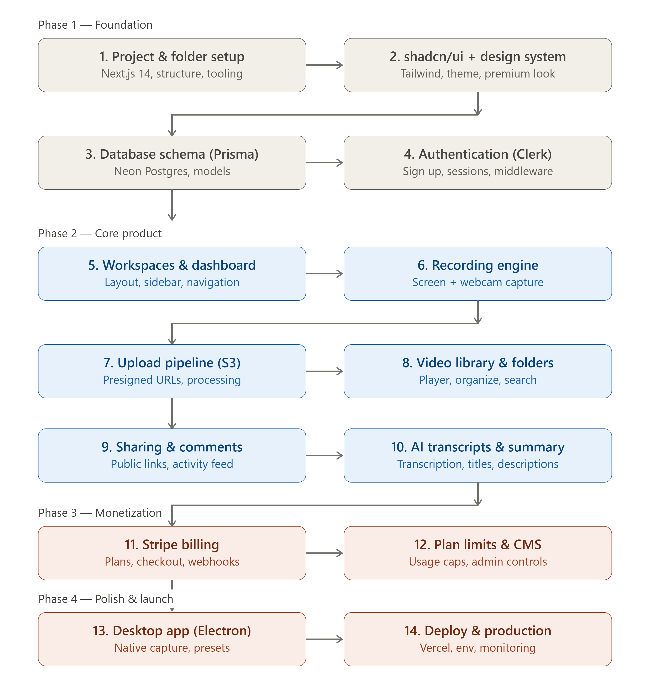
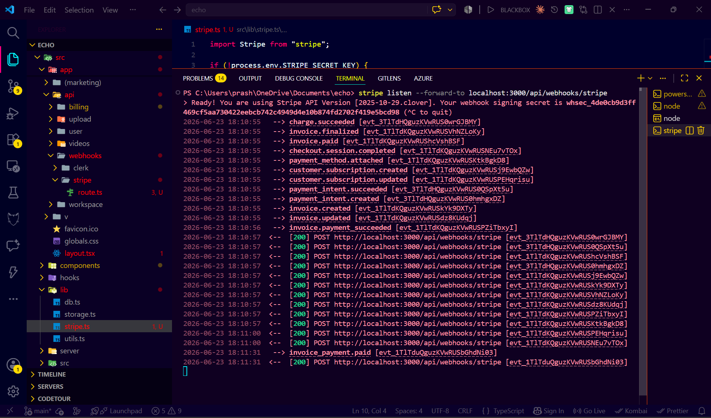
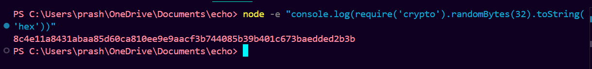
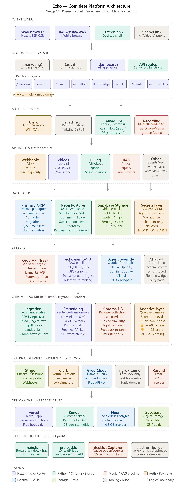

# Echo - AI Video Recording and Automations


## Getting Started

First, run the development server:

```bash
npm run dev

```

### End to End Pipeline



Open Prisma Studio:

```bash
npx prisma studio
```


```bash
stripe listen --forward-to localhost:3000/api/webhooks/stripe
```



### Features

#### Complete project summary

Every feature built across this entire session:
Core product (video SaaS):

1. Landing page with hero, features, pricing, footer
2. Clerk auth with sign-in/up, route protection, webhook user sync
3. Dashboard with fixed sidebar, video library grid, search, delete
4. Screen + webcam recording with MediaRecorder
5. Supabase video upload pipeline
6. Public video player with custom controls
7. Timestamped comments
8. AI transcription + summary (Groq Whisper + Llama)
9. Settings page (profile + workspace)
10. Stripe billing (free/pro, checkout, customer portal)
11. Electron desktop app with tray, native capture, device presets

```bash
node -e "console.log(require('crypto').randomBytes(32).toString('hex'))"
```



#### System Architecture

